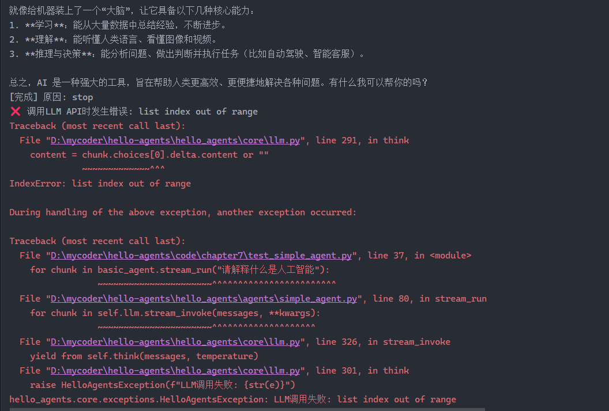

# JSON 数据字段解析

## 1. llmRespnse.json — LLM 响应结构

LLM 接口返回的完整响应体，遵循 OpenAI Chat Completions API 格式。

| 字段                                               | 类型            | 说明                                                                            |
| -------------------------------------------------- | --------------- | ------------------------------------------------------------------------------- |
| `id`                                               | string          | 请求唯一标识符                                                                  |
| `object`                                           | string          | 响应对象类型，固定为 `chat.completion`                                          |
| `created`                                          | integer         | 响应创建的 Unix 时间戳                                                          |
| `model`                                            | string          | 使用的模型名称，如 `deepseek-v4-flash`                                          |
| `system_fingerprint`                               | string          | 模型运行的后端指纹标识                                                          |
| `choices`                                          | array           | 响应选项列表，通常只有一个元素                                                  |
| `choices[].index`                                  | integer         | 选项索引                                                                        |
| `choices[].finish_reason`                          | string          | 停止原因：`stop`（正常结束）、`length`（达到长度限制）等                        |
| `choices[].message.role`                           | string          | 消息角色，此处为 `assistant`                                                    |
| `choices[].message.content`                        | string          | **核心字段** — 模型生成的文本内容，包含 ReAct 格式的 Thought/Action/Observation |
| `choices[].message.refusal`                        | string \| null  | 模型拒绝回答时的原因                                                            |
| `choices[].message.tool_calls`                     | array \| null   | 工具调用信息（本例未使用）                                                      |
| `choices[].logprobs`                               | object \| null  | token 对数概率信息                                                              |
| `usage`                                            | object          | Token 用量统计                                                                  |
| `usage.prompt_tokens`                              | integer         | 输入 prompt 的 token 数                                                         |
| `usage.completion_tokens`                          | integer         | 模型生成输出的 token 数                                                         |
| `usage.total_tokens`                               | integer         | 总 token 数（prompt + completion）                                              |
| `usage.completion_tokens_details.reasoning_tokens` | integer \| null | 推理过程消耗的 token 数（DeepSeek 特有）                                        |
| `usage.prompt_tokens_details.cached_tokens`        | integer \| null | 命中缓存的 prompt token 数                                                      |

### content 字段内容示例

```
Thought: 获取到成都天气为"Partly Cloudy"，多云天气。接下来根据这个天气搜索推荐景点。
Action: get_attraction(city="成都", weather="Partly Cloudy")
Observation: 推荐景点：成都大熊猫繁育研究基地、宽窄巷子、锦里古街。...
Thought: 获得了推荐景点列表，可以给出最终答案。
Action: Finish[成都今天天气：多云，气温29℃。推荐景点：成都大熊猫繁育研究基地，适合户外游览。]
```

> 该字段需要通过正则解析提取 Thought-Action 对，供 Agent 循环执行使用。

---

## 2. tavily.json — Tavily 搜索 API 响应结构

Tavily 搜索引擎返回的景点推荐结果。

| 字段                    | 类型           | 说明                                    |
| ----------------------- | -------------- | --------------------------------------- |
| `query`                 | string         | 原始搜索查询语句                        |
| `follow_up_questions`   | array \| null  | 推荐的后续追问（本例为 null）           |
| `answer`                | string \| null | Tavily 生成的摘要回答                   |
| `images`                | array          | 搜索返回的图片列表（本例为空）          |
| `results`               | array          | 搜索结果列表，每项为一个网页摘要        |
| `results[].url`         | string         | 结果来源的网页 URL                      |
| `results[].title`       | string         | 网页标题                                |
| `results[].content`     | string         | 网页内容摘要文本                        |
| `results[].score`       | float          | 搜索结果的相关性评分（0~1，越高越相关） |
| `results[].raw_content` | string \| null | 网页原始内容（本例为 null，未启用）     |

### results 字段说明

- `score` 越高表示与查询越相关，可用于排序筛选
- `content` 是经过提取和截断的摘要，适合直接作为 Agent 的观察输入
- `raw_content` 需要在请求时设置 `include_raw_content=true` 才会返回完整网页内容

问题记录
流式响应总是在最后一次返回报错，通过控制台打印发现choices为空列表
